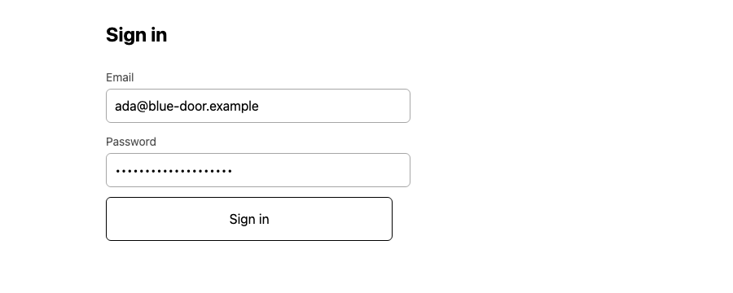
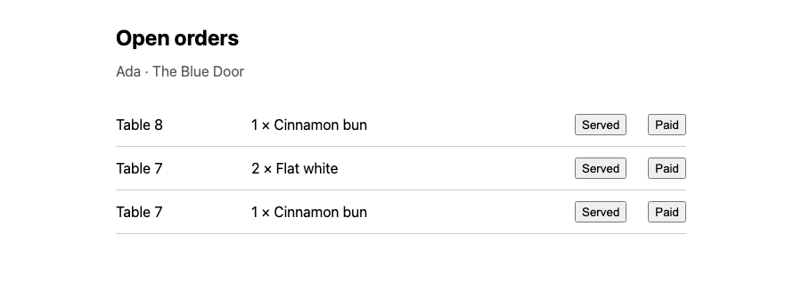

# Table-side ordering for restaurants

Self-hosted table-side ordering, built in the open under AGPL-3.0. A guest opens
the code printed on their table, sees the menu, and sends a round to the kitchen
from the page — no app to install, and no request to any origin but the one that
served it.

**Status:** 2026-08-27 · a member of staff signs in on a page of their own,
reads every open order in their restaurant, records a round as paid for, and
clears a ticket from the board when the kitchen has served it.

[](https://github.com/sebkoo/table-ordering/actions/workflows/ci.yml)

[](https://github.com/sebkoo/table-ordering/releases/tag/v0.1.0)

*The guest's page, captured at `a8f828f`. The picture links to the `v0.1.0`
release, whose one asset is a 32 s take of the whole loop — a guest sends a
round, a member of staff signs in, and the round is on the board — produced by
`tools/record-demo.ts`.*

## Why

Every table-ordering product I looked at wanted a percentage of card volume, a
tablet on every table, or both — and most of what they were charging for was a
menu on a screen. The menu is not the hard part. The hard part is making one
guest's order survive a retry, a dropped signal, and a kitchen screen that
somebody else is updating at the same moment. That is worth building carefully,
and it is worth being able to run yourself.

## Run it

Requires Node 24 (see `.nvmrc`), pnpm, and Docker for PostgreSQL.

```sh
git clone https://github.com/sebkoo/table-ordering.git
cd table-ordering
pnpm install
docker compose up -d
```

PostgreSQL is published on host port 55432 rather than 5432, so that it comes
up beside whatever PostgreSQL you already run. If 55432 is taken, change it in
`compose.yaml` and set `DATABASE_URL` to match.

Create the schema. There is no migration runner yet, so this is `psql` reading
each migration in turn, on a database that has had none of them —
re-applying one raises `relation already exists`, and nothing is applied —
the loud failure the absence of a runner rests on. `--single-transaction` is
not optional: without it `psql` commits each statement as it goes, and a file
that failed halfway would leave the half behind
([ADR 0015](docs/adr/0015-apply-the-second-migration-by-hand.md)):

```sh
for m in services/api/migrations/*.up.sql; do
  docker compose exec -T postgres \
    psql -U table_ordering -d table_ordering --single-transaction < "$m"
done
```

Give it a restaurant to serve, and a table to sit at. There is no admin route
yet either. The code is the address the table's card will carry, so mint it
rather than choose it — `openssl rand -hex 6` produced the one below — and do
not name the table in it.

The flag is not optional here either, and it buys more than it does above.
`restaurant` and `restaurant_table` each carry a unique constraint that stops a
second run; `menu_item` carries none. Without `--single-transaction` a repeated
run therefore leaves the item behind on its own, duplicated, while the two
inserts around it fail — and `psql` exits 0 having reported the failures on
stderr and nothing about what it kept:

```sh
docker compose exec -T postgres \
  psql -U table_ordering -d table_ordering --single-transaction <<'SQL'
insert into restaurant (slug, name) values ('blue-door', 'The Blue Door');
insert into menu_item (restaurant_id, name, price_minor, currency, sort_order)
select id, 'Flat white', 300, 'GBP', 10 from restaurant where slug = 'blue-door';
insert into restaurant_table (restaurant_id, code, label)
select id, '9f3c1a7b20de', 'Table 7' from restaurant where slug = 'blue-door';
SQL
```

Then start the API and ask it for that table's menu:

```sh
pnpm dev
curl -s localhost:3000/tables/9f3c1a7b20de/menu
```

```json
{"restaurant":{"slug":"blue-door","name":"The Blue Door"},"table":{"label":"Table 7"},"items":[{"id":"8f14e45f-ceea-467a-9f0b-2c2e0a3f7c31","name":"Flat white","priceMinor":300,"currency":"GBP"}]}
```

## What's here

The roadmap below is complete — every row Done — and the depth is one link from
it: [what happens at the table](docs/what-happens-at-the-table.md), [how a
request is served](docs/how-a-request-is-served.md), [the run steps in
full](docs/run-it-in-full.md), the decisions in [`docs/adr/`](docs/adr/), and
the limitations in [`docs/known-limitations.md`](docs/known-limitations.md).

A moving picture of the loop is produced by `tools/record-demo.ts`. The producer
is in this tree; what it emits is not.

## What it looks like

The pages, and the loop between them: a guest sends a round from the table, a
member of staff signs in, and the round is on the board. Each picture is a
capture of the running product, and its caption names the revision it was taken
at.



*The board's sign-in, captured at `a8f828f`. What was typed into the password
field is masked by the browser, and no value from it is in the picture.*



*The board, captured at `0fe409d`.*

## What happens at the table

The API serves a restaurant's menu, takes an order from a table's printed code,
reads that table's own orders back, and answers a staff session with the
restaurant's open orders — and the guest's page and the board are what a phone
and a kitchen screen see of it. The whole narrative, request by request and
answer by answer, is in
[`docs/what-happens-at-the-table.md`](docs/what-happens-at-the-table.md).

## How a request is served

Two paths through the code, and both are one transaction of the same shape: the
printed code resolves to a restaurant, the scope is set on that transaction from
the row the resolve returned, and every statement after it names no restaurant at
all. The diagrams that trace the menu read and the order write layer by layer —
route, transaction, policy, PostgreSQL, and what each one answers — are in
[`docs/how-a-request-is-served.md`](docs/how-a-request-is-served.md).

## Roadmap

Every row is Done. That is a statement about this list and not about the
product being finished: the list is what was planned when it was written.

| Step | State |
| --- | --- |
| Toolchain, convention checks, CI | Done |
| Tenant schema | Done |
| Guest menu, over HTTP | Done |
| A page the guest's phone loads | Done |
| A table's own code, on the guest's page | Done |
| Order submission over HTTP, tolerating retries | Done |
| Row-level security on a write, so scope is not the query's job | Done |
| The guest's page sends the order | Done |
| A table's own orders, read back under the policy | Done |
| The guest's page shows what the table has sent | Done |
| A member of staff can prove who they are | Done |
| The restaurant's open orders, read under a staff session | Done |
| The board on a page staff sign in to | Done |
| Row-level security on a read, so a menu query drops its scope too | Done |
| A kitchen board a ticket can be acted on from | Done |
| Payment, as an option rather than a requirement | Done |

## Run it in full

The quickstart above is enough to see a menu. The rest of the walkthrough — the
role the API connects as, ordering and reading back with `curl`, a member of
staff, the two pages, and what the checks do — is in
[`docs/run-it-in-full.md`](docs/run-it-in-full.md).

## Decisions

Architecture decisions are in [`docs/adr/`](docs/adr/), one file per decision,
each with the alternatives that were rejected and why.

- [0001 Record architecture decisions](docs/adr/0001-record-decisions.md)
- [0002 Pick the toolchain](docs/adr/0002-pick-the-toolchain.md)
- [0003 Choose the name: describe now, brand later](docs/adr/0003-choose-the-name.md)
- [0004 Defer each convention to the commit that creates its first subject](docs/adr/0004-defer-conventions-to-first-subject.md)
- [0005 Choose the AGPL-3.0 licence](docs/adr/0005-choose-the-licence.md)
- [0006 Keep changes small](docs/adr/0006-keep-changes-small.md)
- [0007 Serve HTTP with Fastify, and validate at the boundary](docs/adr/0007-serve-http-with-fastify.md)
- [0008 Version the schema as plain SQL migrations](docs/adr/0008-version-the-schema-as-plain-sql-migrations.md)
- [0009 Render the guest page in the browser](docs/adr/0009-render-the-guest-page-in-the-browser.md)
- [0010 Observe the guest page in a real browser](docs/adr/0010-observe-the-guest-page-in-a-real-browser.md)
- [0011 Report a check whose environment is absent as a skip](docs/adr/0011-skip-a-check-whose-environment-is-absent.md)
- [0012 Record the commit procedure as a skill, and check its mechanical half after a push](docs/adr/0012-record-the-commit-procedure.md)
- [0013 Bound the CI job in time, and take Chromium's libraries from the runner image](docs/adr/0013-bound-the-ci-job.md)
- [0014 Print a table's own code, and make it the guest's URL](docs/adr/0014-print-a-tables-own-code-and-make-it-the-guests-url.md)
- [0015 Apply the second migration by hand, and defer the runner to a named trigger](docs/adr/0015-apply-the-second-migration-by-hand.md)
- [0016 Make every run step atomic, and check the flag rather than restate it](docs/adr/0016-make-every-run-step-atomic.md)
- [0017 Check the procedure by running it, not by matching its text](docs/adr/0017-check-the-procedure-by-running-it.md)
- [0018 Pick a revision's newest run, and extract only a picking that fails silently](docs/adr/0018-pick-a-revisions-newest-run.md)
- [0019 Take the action release that ends the Node 20 notice, and report a run's warnings without asserting them](docs/adr/0019-report-a-runs-warnings-without-asserting-them.md)
- [0020 Scope a write with row-level security, carried on the transaction](docs/adr/0020-scope-a-write-with-row-level-security.md)
- [0021 Record an order as a submission with lines, and nothing else](docs/adr/0021-record-an-order-as-a-submission-with-lines.md)
- [0022 Take a check's inputs from the repository, not from the machine](docs/adr/0022-take-a-checks-inputs-from-the-repository.md)
- [0023 Mint a submission id per send, and keep it until the API answers](docs/adr/0023-mint-a-submission-id-per-send.md)
- [0024 Report what each test file cost, and assert nothing about it](docs/adr/0024-report-what-each-test-file-cost.md)
- [0025 Check the subject clauses a program can decide, and say which one it cannot](docs/adr/0025-make-the-subject-clauses-executable.md)
- [0026 Read a table's open orders by its printed code, and defer the board to a staff identity](docs/adr/0026-read-a-tables-open-orders-by-its-printed-code.md)
- [0027 Show the table's orders on the guest's page, refreshed only by a send](docs/adr/0027-show-the-tables-orders-on-the-guests-page.md)
- [0028 Check the window where it is restated, and leave the records alone](docs/adr/0028-check-the-window-where-it-is-restated.md)
- [0029 Verify a staff credential with scrypt, and carry it as a session token](docs/adr/0029-verify-a-staff-credential-and-carry-a-session.md)
- [0030 Read the restaurant's open orders from the staff session, and name the table rather than its code](docs/adr/0030-read-the-restaurants-open-orders-from-the-staff-session.md)
- [0031 Show the board on a page staff sign in to, and hold the token in memory alone](docs/adr/0031-show-the-board-on-a-page-staff-sign-in-to.md)
- [0032 Show both pages in the README as dated captures, and defer the check that would hold them](docs/adr/0032-show-both-pages-as-dated-captures.md)
- [0033 Read the menu under a policy, and split the resolve from the read](docs/adr/0033-read-the-menu-under-a-policy.md)
- [0034 Clear a ticket by recording when it was served, and leave the guest's list alone](docs/adr/0034-clear-a-ticket-by-recording-when-it-was-served.md)
- [0035 Check a suite's migration list against the directory, by two keys](docs/adr/0035-check-a-suites-migration-list-against-the-directory.md)
- [0036 Record a round as paid, gate nothing on it, and leave the bill to the sitting](docs/adr/0036-record-a-round-as-paid-and-gate-nothing-on-it.md)
- [0037 Produce the demo from a script in the tree, and publish it as a release asset](docs/adr/0037-produce-the-demo-from-a-script-in-the-tree.md)
- [0038 Order the README for a reader who scans, and move nothing out of its collectors' sight](docs/adr/0038-order-the-readme-for-a-reader-who-scans.md)
- [0039 Relocate only a section no collector reads, and link the demo from the front door](docs/adr/0039-relocate-only-what-no-collector-reads.md)
- [0040 Widen the window's sight to the documents, and move Known limitations out](docs/adr/0040-widen-the-windows-sight-to-the-documents.md)
- [0041 Move the depth into `docs/`, and widen the run steps' sight to reach it](docs/adr/0041-move-the-depth-under-the-rules-sight.md)

## Known limitations

Every limitation this project knows about is written down at length in
[`docs/known-limitations.md`](docs/known-limitations.md) — what a second opening
of a printed code can do, what a table's code discloses to whoever holds it,
what the board cannot do yet, and what each convention rule is blind to. It is
the honest half of every claim this project makes, and it is a document for the
same reason the two above it are: the depth belongs in `docs/`, where a rule can
still read it.

## Non-goals

- Replacing a restaurant's point-of-sale system.
- A delivery marketplace, or anything that puts a third party between the
  restaurant and its guest.
- An app for guests to download.
- Taking a percentage of the money that moves through it.

## Money

This platform takes zero basis points of card volume. That is a statement about
what this software charges, not a claim about what a restaurant pays overall:
the restaurant still pays its own card processor, whoever that is.

A round can be recorded as paid for, and nothing requires it. That is the whole
of what is built: a moment on the order, written by a member of staff, read by
the board and by nobody else. There is no amount, no currency and no card —
recording a fact is not handling money, and an amount would be a ledger, which
is its own decision.

Payment *handling* is not built and no processor is planned. Routing a
self-hosted restaurant's guests through somebody else's checkout is the thing
the sentence "no third-party requests" rules out, and it is the reason the
option is a fact to record rather than a flow to run
([ADR 0036](docs/adr/0036-record-a-round-as-paid-and-gate-nothing-on-it.md)).
If this ever needs to fund itself, the honest routes are hosting, support and
integration work — the same routes that are available under any licence —
rather than a cut of the till.

## Licence

AGPL-3.0-only. The full text is in [`LICENSE`](LICENSE); the reasoning, and the
licences that were rejected, are in
[ADR 0005](docs/adr/0005-choose-the-licence.md).

— Ben Koo
